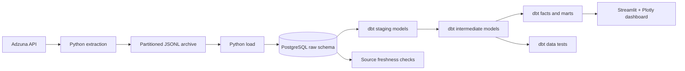
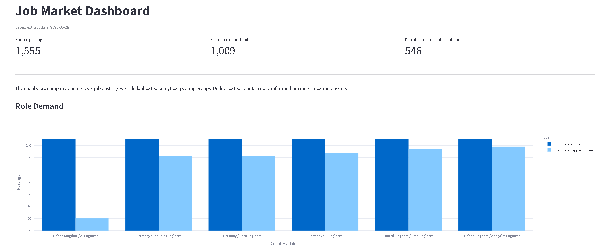
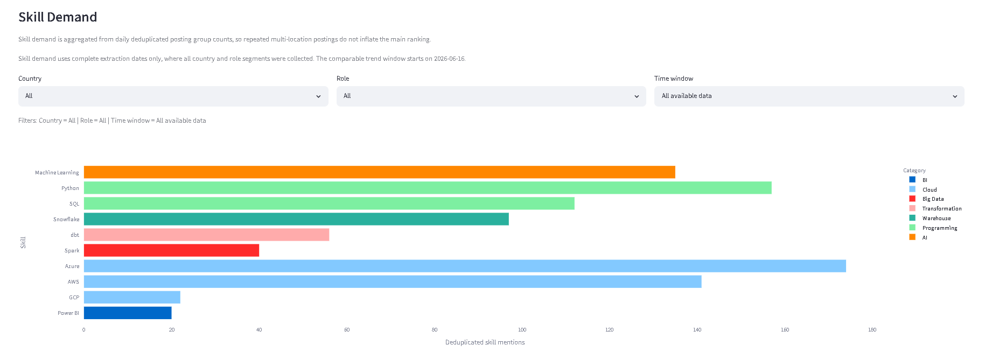
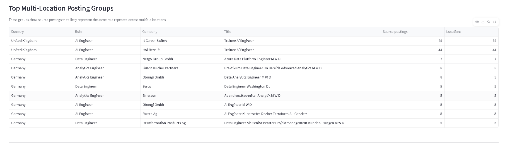

# Germany & UK Data / AI Job Market Pipeline

An end-to-end, production-inspired batch data pipeline that collects recurring Data and AI job-market snapshots from the Adzuna API, preserves raw JSONL records, loads them idempotently into PostgreSQL, models them with dbt, and serves deduplication-aware insights through Streamlit.

> **Status:** Active development. The core manual batch workflow is operational and accumulating historical data. Backup and restore, Docker-based reproducibility, and Airflow orchestration are the next engineering milestones.

**Stack:** Python 3.12 · PostgreSQL · dbt Core · Streamlit · Plotly · JSONL

## At a Glance

| Metric | Latest verified value |
|---|---:|
| Latest validated batch | 2026-08-13 |
| Markets | Germany and United Kingdom |
| Search segments | 2 countries × 3 role groups |
| Observations per complete batch | 900 |
| Historical observations | 13,800 |
| Unique raw source postings | 3,897 |
| Deduplicated analytical posting groups | 2,398 |
| Complete six-segment batch dates | 15 |
| Latest dbt build | 133/133 passed |

The project focuses on Data Engineer, Analytics Engineer, and AI Engineer roles. Each complete batch collects three pages of 50 results for every country and role combination.

## Architecture



Raw API responses are retained outside Git at:

```text
data/raw/adzuna/
  country=XX/
    search_role=ROLE/
      date=YYYY-MM-DD/
        jobs.jsonl
```

This provides a replayable source archive while PostgreSQL supports relational constraints, observation history, transformation, and reporting.

## Latest Validated Run

The batch completed on **2026-08-13** with:

```text
900 job observations fetched and archived
254 new unique source postings inserted
646 existing source postings safely skipped
900 observations inserted
0 duplicate observations
0 orphan observations
2/2 dbt sources fresh
PASS=133 WARN=0 ERROR=0 SKIP=0 TOTAL=133
```

After the run, the database contained:

```text
raw.job_postings: 3,897 unique source postings
raw.job_posting_observations: 13,800 historical observations
analytics.mart_latest_postings: 3,893 observed postings
deduplicated analytical posting groups: 2,398
```

The four-row difference between the raw posting catalog and the latest-postings mart comes from early development records that predate the observation-history workflow.

## What This Project Demonstrates

- API ingestion with pagination, request timeouts, and credential isolation
- date-, country-, and role-partitioned raw data archiving
- idempotent PostgreSQL loading with database constraints
- separation of source job entities from recurring search observations
- dbt staging, intermediate, fact, and mart layers
- source freshness checks plus generic and custom data tests
- dictionary-based skill extraction with a controlled dbt seed
- deduplication-aware analytics for multi-location postings
- dashboard-ready datasets and interactive Streamlit reporting
- honest handling of incomplete source coverage and analytical uncertainty

## Key Engineering Decisions

### Separate job entities from observations

The raw layer contains two main tables:

```text
raw.job_postings
raw.job_posting_observations
```

`raw.job_postings` stores one row per unique `source + job_id`. `raw.job_posting_observations` records when that posting was seen for a country, role, and extraction date.

This prevents repeated batches from duplicating the job catalog while preserving a time series of market observations.

### Make reruns safe

Postings and observations use database uniqueness constraints with `ON CONFLICT DO NOTHING`. Re-running the same load therefore skips existing job entities and same-day observations instead of creating duplicates.

### Preserve the raw grain and deduplicate analytically

Adzuna can return the same apparent opportunity under multiple source job IDs or locations. The raw source grain remains unchanged for traceability.

For reporting, `int_job_posting_groups` creates an analytical `posting_group_id` from:

```text
source
+ search_country
+ normalized_company_name
+ normalized_job_title
+ description_hash
```

Location is intentionally excluded because it is often the source of repeated postings. This is a practical heuristic rather than a claim of perfect real-world job identity resolution.

Downstream models retain both perspectives:

```text
source posting counts
deduplicated analytical posting-group counts
```

### Use complete batches for trends

Missed extraction dates are not treated as zero demand. Skill trend charts use only dates where all six country-role segments were collected, preventing partial batches from appearing as false market changes.

### Materialize reusable heavy transformations

The posting-group model was initially a view. Repeated normalization and hashing made a downstream mart take roughly 220 seconds during local validation.

Materializing the reusable intermediate model as a table reduced the same workload substantially; the latest full dbt build completed in approximately 35 seconds.

## Data Model

| Layer | Models |
|---|---|
| Raw sources | `job_postings`, `job_posting_observations` |
| Staging | `stg_job_postings`, `stg_job_posting_observations` |
| Intermediate | `int_job_posting_skills`, `int_job_posting_groups` |
| Facts | `fct_role_demand_daily`, `fct_skill_demand_daily` |
| Marts | `mart_country_role_skill_demand`, `mart_latest_postings`, `mart_skill_demand_dashboard` |
| Seed | `skill_dictionary` |

The current skill extraction snapshot contains 904 job-skill matches across 584 postings, with 26 distinct skills represented in the data.

## Data Quality

The dbt project currently runs **123 data tests** across nine models and one seed. Coverage includes:

- `not_null`
- `unique`
- `accepted_values`
- `relationships`
- source freshness
- custom assertions ensuring deduplicated counts do not exceed source counts

PostgreSQL adds primary keys, foreign keys, uniqueness constraints, indexes, and a salary-range check at the raw layer.

Additional raw-layer checks are available in [`sql/002_raw_data_quality_checks.sql`](sql/002_raw_data_quality_checks.sql).

## Dashboard

The Streamlit dashboard provides:

- source postings versus deduplicated analytical groups
- country and role demand comparisons
- multi-location inflation auditing
- deduplicated skill rankings and trends
- filters for country, role, and time window
- a searchable latest-postings table

### Dashboard milestone preview

The screenshots below were captured on **2026-06-29** using data through **2026-06-28**. They demonstrate the working interface and are not intended to mirror every later batch refresh. Screenshots are updated when the dashboard changes materially or when a new portfolio milestone is published.

#### Overview and role demand



#### Skill demand



<details>
<summary><strong>Additional view: multi-location posting groups</strong></summary>



</details>

## Technology Choices

| Technology | Role in the project |
|---|---|
| Python | API extraction, archive writing, mapping, and PostgreSQL loading |
| PostgreSQL | Raw storage, constraints, JSONB retention, and analytical persistence |
| dbt Core | Transformation, documentation, lineage, freshness, and testing |
| Streamlit | Local interactive analytics application |
| Plotly | Role and skill-demand visualizations |
| JSONL | Simple, replayable raw API archive |

PostgreSQL keeps the project sustainable without cloud trial limits or billing. It also leaves a natural path to `pgvector` if semantic search becomes justified later.

## Project Structure

```text
src/
  extract/
    adzuna_client.py
    archive_writer.py
    run_adzuna_extract.py
  load/
    jsonl_reader.py
    job_mapper.py
    postgres_loader.py
    run_postgres_load.py
sql/
  001_create_raw_schema.sql
  002_raw_data_quality_checks.sql
dbt_job_market/
  models/
    staging/
    intermediate/
    marts/
  seeds/
  tests/
dashboard/
  app.py
data/
  raw/
backups/
reports/
  weekly/
docs/
  screenshots/
```

Raw archives, database backups, logs, virtual environments, generated dbt artifacts, and secrets are excluded from Git.

## Running Locally

The project currently targets Windows PowerShell and Python 3.12.

### 1. Create the environment

```powershell
python -m venv .venv
.\.venv\Scripts\Activate.ps1
pip install -r requirements.txt
```

### 2. Configure credentials

Copy `.env.example` to `.env` and provide the local Adzuna and PostgreSQL values. The real `.env` file must remain outside Git.

dbt also expects a local profile named `dbt_job_market` that targets the PostgreSQL `analytics` schema. The profile is stored outside this repository.

### 3. Initialize the raw schema

After creating the local database and user, apply the raw PostgreSQL schema:

```powershell
psql -h localhost -U job_market_user -d job_market -f .\sql\001_create_raw_schema.sql
```

### 4. Run the recurring batch

```powershell
python src\extract\run_adzuna_extract.py
python src\load\run_postgres_load.py
dbt source freshness --project-dir .\dbt_job_market
dbt build --project-dir .\dbt_job_market
```

### 5. Open the dashboard

```powershell
python -m streamlit run dashboard\app.py
```

The dashboard expects PostgreSQL and the dbt marts to be available locally.

<details>
<summary><strong>Generate dbt documentation and lineage</strong></summary>

```powershell
dbt docs generate --project-dir .\dbt_job_market
dbt docs serve --project-dir .\dbt_job_market
```

The generated documentation is available locally at `http://localhost:8080` while the server is running.

</details>

## Limitations

- Adzuna is one source and does not represent the full German or UK job market.
- Each batch is capped at 150 results per country-role segment.
- Skill extraction is dictionary-based and may miss context, aliases, or uncommon technologies.
- Analytical posting groups reduce obvious multi-location inflation but are not perfect entity resolution.
- Salary availability is uneven across countries and currency metadata is absent in the current source payloads, so salary comparisons are intentionally not presented.
- The pipeline is currently scheduled manually. Missing dates mean no batch was run; observations are never synthetically backfilled.
- This is an actively developed portfolio system, not a production deployment.

## Roadmap

The next milestones are intentionally ordered around data reliability before adding AI features:

1. create and verify PostgreSQL backup and restore procedures
2. add Docker Compose with PostgreSQL, a named volume, and a health check
3. validate a parallel migration without risking the existing local database
4. evaluate containerization of the Python/dbt workflow and Streamlit
5. add Airflow orchestration with retries, timeouts, logging, and explicit failure behavior
6. generate a deterministic weekly Markdown market report
7. add CI checks for dbt build and data tests
8. consider LLM-assisted reporting and a grounded `pgvector` RAG workflow only after the core pipeline is reliable

## License

This project is available under the [MIT License](LICENSE).
