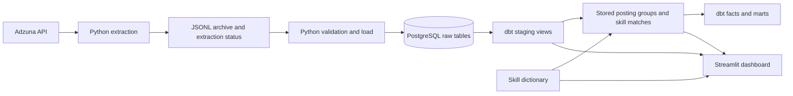

# Job Market Data Pipeline

A Python and SQL project that collects job adverts from Germany and the UK, stores historical observations in PostgreSQL, and uses dbt to prepare data for a Streamlit dashboard.

I built it to explore which skills appear in collected adverts and how repeated postings affect the results. The project also covers practical data engineering tasks, including safe archive handling, repeatable loading, data quality checks and query optimisation.

**Built with:** Python · PostgreSQL · dbt Core · Streamlit · Plotly

## What I built

- A batch pipeline that keeps raw API responses and tracks when each advert appears in a search.
- Archive validation and repeatable loading, so rerunning a load does not add the same records again.
- dbt models with 123 data tests covering missing values, uniqueness, relationships and count consistency.
- A dashboard for comparing skill mentions, exploring adverts and inspecting repeated posting groups.
- SQL performance improvements checked against the original results. One read query fell from 59.42 seconds to 0.25 seconds in local testing, with the same 5,002 rows.

The reporting workflow covers Data Engineer, Analytics Engineer and AI Engineer searches in both countries. Data Analyst collection has started separately and is not yet included in the dashboard. Collection and model refreshes currently run manually.

## Dashboard

The dashboard starts with the most mentioned skills and a watchlist, followed by posting counts for the selected date. Country and role filters let users narrow the sample.

| View | What it shows |
|---|---|
| Overview | Top skills, a watchlist, and source postings compared with analytical groups |
| Skills | Rankings, trends and all 53 tracked skills, including those with no matched mentions |
| Explore Postings | Search by job title, company or location |
| Data Quality | Repeated posting groups and observed collection coverage |

The skill dictionary tracks technologies such as Databricks, Microsoft Fabric and Power BI alongside programming, data engineering and analytical skills. These are terms found in adverts, not tools used to build the pipeline.

## Architecture



The dashboard reads dbt staging observations, stored posting groups, stored skill matches and the dictionary. Daily facts and reporting marts provide reusable reporting tables. Source freshness checks and dbt tests validate the data separately from this flow.

## Performance improvements

I investigated repeated SQL work and checked that the faster versions preserved the results. These measurements were taken locally on 2026-09-06.

| Change | Evidence |
|---|---|
| Latest-postings query uses `DISTINCT ON` | Read query: 59.421 seconds before, 0.245 seconds for the candidate. Both returned 5,002 rows with no differences in either direction. Selected dbt model build: 0.71 seconds. |
| Store skill matches as a dbt table | View read: 24.348 seconds; temporary-table read: 0.006 seconds. All 2,051 rows matched, including duplicates. |
| Reuse stored skill matches downstream | Daily skill fact build: 24.73 seconds before, 0.21 seconds after. |

Building the skill table still took 24.55 seconds. The change removes repeated computation from reads and downstream models. Run dbt after loading new postings or updating the dictionary. The selected four-model build took 27.96 seconds; it is not directly comparable to a full build.

<details>
<summary>Data handling and calculation details</summary>

## Collection and loading

Each default run requests three pages of up to 50 results for six country/role segments. This is up to 900 returned records, not necessarily 900 distinct adverts or new observations.

Archives use this structure:

```text
data/raw/adzuna/country=XX/search_role=ROLE/date=YYYY-MM-DD/
  jobs.jsonl
  extraction_status.json
```

- Existing archives or extraction status files block another extraction for that segment and date.
- JSONL is written through a temporary file without replacing an existing archive.
- New status files record requested pages, per-page counts, completion status and an archive checksum.
- The loader validates all six expected archives before loading any segment.
- Old archives without status files are accepted with a warning: page completion is unverified.
- Database constraints and `ON CONFLICT DO NOTHING` prevent repeated postings and observations from being inserted again.
- Loading commits by segment; the complete batch is not one database transaction. A later database failure can leave earlier segments loaded. Safe reruns complete the remaining work.

## Analytical rules

### Source postings and groups

The raw catalog stores one row per `source + job_id`. Observations record when that posting appeared in a country/role search.

Analytical groups use source, country, normalized company, normalized title and a description hash. Location is excluded. Matching text may represent repeated adverts, reposts or separate vacancies with similar descriptions. **Groups are not verified unique vacancies.** The difference between source and group counts is not a confirmed duplicate count or a measure of total market inflation.

### Skill mentions

The dictionary includes Databricks, Microsoft Fabric, Power BI, DAX, Power Query, dbt, Spark, A/B testing and other skills. Pipe-separated aliases handle phrases such as `power bi|powerbi` and `spark|pyspark`. Multiple aliases count only once for each posting and skill.

Matching uses normalized description snippets, limited to 500 characters in the current archive. It can miss requirements and produce ambiguous matches. A zero means no matched mention, not no market demand. Updating the dictionary and rebuilding dbt rescores stored descriptions.

The dashboard counts a group once per skill and date across selected roles. A group can mention several skills, so percentages across skills need not sum to 100%.

For multi-day skill analysis:

- Include only dates with observations in every selected country/role segment.
- Count no mention on an included date as zero; do not fill missing dates with zeros.
- Divide total matching group-days by total observed group-days for the percentage.
- Include zero-mention dates in the daily average.

Observed coverage does not prove every requested API page completed. The dashboard does not yet read extraction status files. Its calculation is implemented in the dashboard; existing aggregate marts should be reviewed against these rules before building Power BI measures.

</details>

## Run locally

The dashboard needs PostgreSQL and built dbt models. Its five-minute cache can be cleared with **Refresh data** after a successful build; this button does not run dbt.

From the repository root in Windows PowerShell:

```powershell
python -m venv .venv
.\.venv\Scripts\Activate.ps1
pip install -r requirements.txt
```

Copy `.env.example` to `.env` and supply local Adzuna and PostgreSQL credentials. Keep `.env` outside Git. Configure a local dbt profile named `dbt_job_market` targeting the PostgreSQL `analytics` schema. After creating the database and user, initialize the raw schema:

```powershell
psql -h localhost -U job_market_user -d job_market -f .\sql\001_create_raw_schema.sql
```

Run each command separately and stop if one fails:

```powershell
python src\extract\run_adzuna_extract.py
python src\load\run_postgres_load.py --check-only
python src\load\run_postgres_load.py
dbt source freshness --project-dir .\dbt_job_market
dbt build --project-dir .\dbt_job_market
python -m streamlit run dashboard\app.py
```

Validate or replay a specific archived date without fetching again:

```powershell
python src\load\run_postgres_load.py --date 2026-09-06 --check-only
python src\load\run_postgres_load.py --date 2026-09-06
```

Opt-in Data Analyst collection, kept outside the current reporting workflow:

```powershell
python src\extract\run_adzuna_extract.py --roles data_analyst
```

Use `--countries gb` to collect only UK archives. The current loader still expects all six default segments for its chosen date; it does not support country or role selection.

Generate dbt documentation with `dbt docs generate --project-dir .\dbt_job_market`. Raw-layer checks are in [sql/002_raw_data_quality_checks.sql](sql/002_raw_data_quality_checks.sql).

## Limitations

Adzuna is one source with a capped sample. Collection is manual and dates are uneven. Training and placement adverts have not been excluded. Salary comparisons are not presented because source coverage and currency information are incomplete.

## Next steps

Planned work, in priority order:

1. **Backup and Docker:** verify database backup and restore, then create a reproducible local setup with Docker Compose.
2. **Data Analyst reporting:** continue collecting archives and review coverage before adding the role to the loader, dbt models and dashboard. Collection can continue while the Docker work is in progress.
3. **Power BI:** build a report using the same counting rules as Streamlit, with checks that both reports agree.
4. **Airflow:** schedule extraction, validation, loading and dbt builds, with retries and clear failure reporting.
5. **CI/CD:** automate code and dbt checks, then add a deployment workflow once a hosting target is chosen.
6. **Vector search and RAG — final phase:** use PostgreSQL with pgvector to explore semantic search over collected adverts, then build a question-answering feature that cites the retrieved records. Evaluate retrieval quality and answer support, accounting for the short source descriptions. This comes after the data pipeline, reporting and automation work above.

Secrets, raw archives, backups, logs, virtual environments and generated dbt artifacts are excluded from Git.

## License

[MIT](LICENSE)
