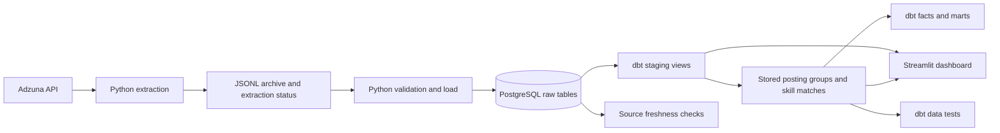

# Germany & UK Job Market Pipeline

A Python batch pipeline that collects job adverts from Adzuna, keeps JSONL archives, loads PostgreSQL, transforms data with dbt, and displays the results in Streamlit.

**Stack:** Python · PostgreSQL · dbt Core · Streamlit · Plotly

## Current status

The workflow runs manually. The dashboard covers Data Engineer, Analytics Engineer and AI Engineer searches in Germany and the UK. Data Analyst collection started on 2026-09-06 and is **archive-only**: it is not loaded by the current loader or included in dbt and the dashboard.

Verified on **2026-09-06**:

| Check | Result |
|---|---:|
| Skill dictionary | 53 skills |
| Stored posting-skill matches | 2,051 |
| Full build before skill materialization change | 9 models, 1 seed and 123 tests passed |
| Affected build after skill materialization change | 4 models and 52 tests passed |
| Latest-postings mart | 5,002 rows |
| Latest dashboard snapshot, both countries and all three roles | 886 source postings, 646 analytical groups |

The latest-snapshot counts differ from accumulated archive counts. Source IDs can appear in several search roles; the overview counts them once across the selected scope.

## Architecture



The dashboard reads staging observations, stored groups, stored skill matches and the dictionary. Daily facts and reporting marts remain available for other consumers. A Power BI report is planned, not implemented.

## Collection and loading

Each default run requests three pages of up to 50 results for six country/role segments. This is up to 900 returned records, not necessarily 900 distinct adverts or new observations.

Archives use this structure:

```text
data/raw/adzuna/country=XX/search_role=ROLE/date=YYYY-MM-DD/
  jobs.jsonl
  extraction_status.json
```

- Existing archives or extraction status files block another extraction for that segment and date.
- JSONL is written through a temporary file without replacing an existing archive.
- New status files record requested pages, per-page counts, completion status and an archive checksum.
- The loader validates all six expected archives before loading any segment.
- Old archives without status files are accepted with a warning: page completion is unverified.
- Database constraints and `ON CONFLICT DO NOTHING` prevent repeated postings and observations from being inserted again.
- Loading commits by segment; the complete batch is not one database transaction. A later database failure can leave earlier segments loaded. Safe reruns complete the remaining work.

## Analytical rules

### Source postings and groups

The raw catalog stores one row per `source + job_id`. Observations record when that posting appeared in a country/role search.

Analytical groups use source, country, normalized company, normalized title and a description hash. Location is excluded. Matching text may represent repeated adverts, reposts or separate vacancies with similar descriptions. **Groups are not verified unique vacancies.** The difference between source and group counts is not a confirmed duplicate count or a measure of total market inflation.

### Skill mentions

The dictionary includes Databricks, Microsoft Fabric, Power BI, DAX, Power Query, dbt, Spark, A/B testing and other skills. Pipe-separated aliases handle phrases such as `power bi|powerbi` and `spark|pyspark`. Multiple aliases count only once for each posting and skill.

Matching uses normalized description snippets, limited to 500 characters in the current archive. It can miss requirements and produce ambiguous matches. A zero means no matched mention, not no market demand. Updating the dictionary and rebuilding dbt rescores stored descriptions.

The dashboard counts a group once per skill and date across selected roles. A group can mention several skills, so percentages across skills need not sum to 100%.

For multi-day skill analysis:

- Include only dates with observations in every selected country/role segment.
- Count no mention on an included date as zero; do not fill missing dates with zeros.
- Divide total matching group-days by total observed group-days for the percentage.
- Include zero-mention dates in the daily average.

Observed coverage does not prove every requested API page completed. The dashboard does not yet read extraction status files. Its calculation is implemented in the dashboard; existing aggregate marts should be reviewed against these rules before building Power BI measures.

## Dashboard

- **Overview:** top ten skills and a watchlist for the selected date, followed by source/group counts and country/role comparisons.
- **Skills:** up to 15 ranked skills, a custom watchlist, trends and all 53 dictionary entries, including zeros. Its date window ends on the selected snapshot date.
- **Explore Postings:** title, company and location search for the selected snapshot; displays up to 100 matching adverts.
- **Data Quality:** repeated groups and observed collection coverage.

Country and role filters apply across tabs. Database reads are cached for five minutes; use **Refresh data** after a successful dbt build. Refreshing the dashboard does not rebuild dbt tables.

Older screenshots in `docs/screenshots/` show a previous interface and are not previews of this version. Updated browser screenshots are still pending.

## Performance checks

These are local measurements on the current dataset, not production guarantees.

| Change | Evidence |
|---|---|
| Latest-postings query uses `DISTINCT ON` | Read query: 59.421 seconds before, 0.245 seconds for the candidate. Both returned 5,002 rows with no differences in either direction. Selected dbt model build: 0.71 seconds. |
| Store skill matches as a dbt table | View read: 24.348 seconds; temporary-table read: 0.006 seconds. All 2,051 rows matched, including duplicates. |
| Reuse stored skill matches downstream | Daily skill fact build: 24.73 seconds before, 0.21 seconds after. |

Building the skill table still took 24.55 seconds. The change removes repeated computation from reads and downstream models. Run dbt after loading new postings or updating the dictionary. The selected four-model build took 27.96 seconds; it is not directly comparable to a full build.

## Run locally

From the repository root in Windows PowerShell:

```powershell
python -m venv .venv
.\.venv\Scripts\Activate.ps1
pip install -r requirements.txt
```

Copy `.env.example` to `.env` and supply local Adzuna and PostgreSQL credentials. Keep `.env` outside Git. Configure a local dbt profile named `dbt_job_market` targeting the PostgreSQL `analytics` schema. After creating the database and user, initialize the raw schema:

```powershell
psql -h localhost -U job_market_user -d job_market -f .\sql\001_create_raw_schema.sql
```

Run each command separately and stop if one fails:

```powershell
python src\extract\run_adzuna_extract.py
python src\load\run_postgres_load.py --check-only
python src\load\run_postgres_load.py
dbt source freshness --project-dir .\dbt_job_market
dbt build --project-dir .\dbt_job_market
python -m streamlit run dashboard\app.py
```

Validate or replay a specific archived date without fetching again:

```powershell
python src\load\run_postgres_load.py --date 2026-09-06 --check-only
python src\load\run_postgres_load.py --date 2026-09-06
```

Opt-in Data Analyst collection, kept outside the current reporting workflow:

```powershell
python src\extract\run_adzuna_extract.py --roles data_analyst
```

Use `--countries gb` to collect only UK archives. The current loader still expects all six default segments for its chosen date; it does not support country or role selection.

Generate dbt documentation with `dbt docs generate --project-dir .\dbt_job_market`. Raw-layer checks are in [sql/002_raw_data_quality_checks.sql](sql/002_raw_data_quality_checks.sql).

## Limitations and next steps

Adzuna is one source with a capped sample. Collection is manual and dates are uneven. Training and placement adverts have not been excluded. Salary comparisons are not presented because source coverage and currency information are incomplete.

Next steps:

1. Review the rendered dashboard and update screenshots.
2. Review Data Analyst coverage after roughly three weeks before integrating it; no automatic activation is configured.
3. Verify backup and restore, then add a small Docker setup.
4. Build Power BI reporting with the same documented counting rules.

Airflow, CI/CD and a separate A/B testing project are deferred. Docker, Power BI and Airflow are not part of the implemented stack.

Secrets, raw archives, backups, logs, virtual environments and generated dbt artifacts are excluded from Git.

## License

[MIT](LICENSE)
