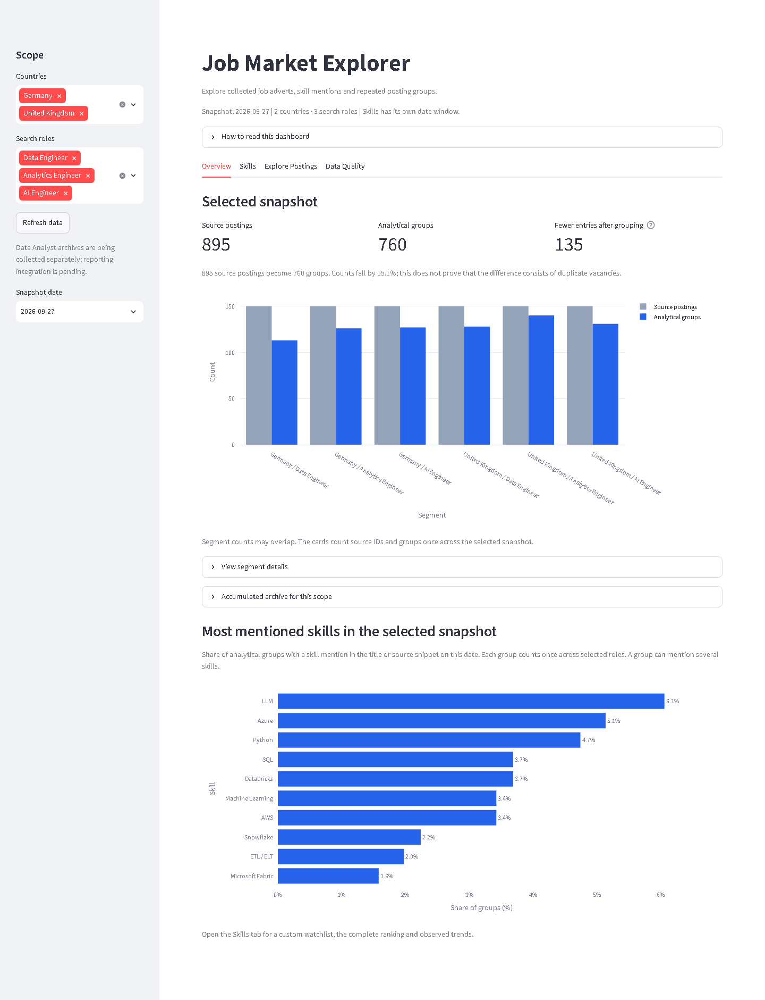
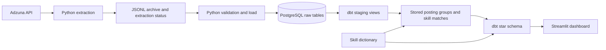

# Job Market Data Pipeline

I collect data-job adverts from Germany and the UK through the Adzuna API, keep every raw response, load them into PostgreSQL and model them with dbt. A Streamlit dashboard sits on top.

I built it to see which skills appear in these adverts and how repeated postings distort the counts. It also covers the less glamorous side of data work: loads that are safe to rerun, adverts that show up several times, data quality checks and slow SQL.

**Built with:** Python · PostgreSQL · dbt Core · Streamlit · Plotly

## What's in it

- A batch pipeline that archives the raw API responses and records every date an advert appears in a search.
- Archive validation and repeatable loading, so rerunning a load never inserts the same record twice.
- Eleven dbt models, one seed and 129 data tests covering missing values, cleaning rules, uniqueness, relationships and count consistency.
- A star schema for reporting: one fact table of observations, dimension tables for postings, posting groups, segments and skills, and a bridge table that links posting groups to skills.
- A dashboard for comparing skill mentions, browsing adverts and inspecting repeated posting groups. It reads only the star schema, calculates its figures in SQL and has a check against the earlier pandas version.
- SQL performance work, with every faster version checked against the original output (details below).

The reporting covers Data Engineer, Analytics Engineer and AI Engineer searches in both countries. I have started collecting Data Analyst adverts too, but they are not in the dashboard yet. Collection and dbt runs are still manual.

## Dashboard

The Overview tab compares source postings with analytical groups for the selected date and shows the most mentioned skills. Country and role filters narrow the sample.



| View | What it shows |
|---|---|
| Overview | Source postings compared with analytical groups, counts by country and role, and the top skills for the selected date |
| Skills | Rankings, a personal watchlist, trends and all 53 tracked skills, including those with no matched mentions |
| Explore Postings | Search by job title, company or location |
| Data Quality | Missing companies, truncated snippets, salary coverage, posting age, repeated posting groups and observed collection coverage |

The skill dictionary includes tools such as Databricks, Microsoft Fabric and Power BI. They are terms found in adverts, not tools used to build this pipeline.

## Architecture


```mermaid
flowchart LR
    A[Adzuna API] --> B[Python extraction]
    B --> C[JSONL archive and extraction status]
    C --> D[Python validation and load]
    D --> E[(PostgreSQL raw tables)]
    E --> F[dbt staging views]
    F --> G[Stored posting groups and skill matches]
    S[Skill dictionary] --> G
    G --> H[dbt star schema]
    S --> H
    H --> I[Streamlit dashboard]
```

The dashboard reads only the star schema. Its queries in [dashboard/queries.py](dashboard/queries.py) apply the counting rules in SQL, and the same rules are described on the fact table in dbt, so another tool can follow them. A separate latest-postings mart keeps one row per advert with its latest search context. Source freshness checks and dbt tests run separately from this flow.

## Dashboard parity check

On 27 September 2026 I moved the dashboard's calculations from pandas to SQL on the star schema. [dashboard/check_parity.py](dashboard/check_parity.py) keeps a copy of the earlier pandas logic and compares it with the new queries for all 21 combinations of countries and roles, on every observed snapshot date. All 9,989 comparisons matched, including the order of skill rankings and posting lists, and shares and averages were exactly equal. When I broke five of the rules on purpose, the check caught every change.

## Backup and restore check

On 7 September 2026 I restored a PostgreSQL backup into a separate test database and compared it with the source. All 11 tables matched, including duplicate rows, and so did the table structures, constraints, indexes, views, ownership and sequence state. The comparisons were read-only and left the source database untouched. The restore ran on the same PostgreSQL 18.4 server, and the backup archive is kept outside Git.

The procedure and results are in [docs/backup_restore_verification.md](docs/backup_restore_verification.md).

## Performance

I looked for SQL that repeated work and checked that each faster version returned exactly the same rows. These measurements were taken locally on 6 September 2026.

| Change | Evidence |
|---|---|
| Latest-postings model uses `DISTINCT ON` instead of a `ROW_NUMBER()` filter | dbt model build: 62.35 s before, 0.71 s after. Read query: 59.42 s before, 0.25 s after. Both versions returned the same 5,002 rows, with no differences in either direction, and the 15 related tests passed. |
| Skill matches stored as a dbt table instead of a view | Reading the view took 24.35 s; reading the stored table took 0.006 s. All 2,051 rows matched, including duplicates. |
| Downstream models reuse the stored skill matches | Daily skill fact build: 24.73 s before, 0.21 s after. The star schema later replaced that model, and its skill bridge reads the same stored matches. |

For the latest-postings model, the query plan showed PostgreSQL estimating 1 row for a join that actually returned 5,002, so it chose nested loops that kept rescanning the same data.

The skill table itself was still slow to build. PostgreSQL inlines a CTE that is used only once, so the text cleaning (lower-casing and `regexp_replace`) ended up inside the join and ran again for every posting and skill pair. The model now declares that CTE as `MATERIALIZED`, so each posting's text is cleaned once. On 27 September 2026 the skill table build fell from 28.58 s to 2.78 s, and the new table matched the old one row for row in both directions.

Run dbt after loading new postings or changing the dictionary.

<details>
<summary>Data handling and calculation details</summary>

### Collection and loading

Each default run requests three pages of up to 50 results for six country and role segments. That is up to 900 returned records, which is not the same as 900 distinct adverts or new observations.

Archives use this layout:

```text
data/raw/adzuna/country=XX/search_role=ROLE/date=YYYY-MM-DD/
  jobs.jsonl
  extraction_status.json
```

- An existing archive or status file blocks another extraction for that segment and date.
- JSONL is written to a temporary file first and never replaces an existing archive.
- Status files record the requested pages, records per page, completion status, description coverage and an archive checksum.
- The loader validates all six expected archives before it loads any segment.
- Older archives without a status file are accepted with a warning, because their page completion cannot be verified.
- Database constraints and `ON CONFLICT DO NOTHING` stop repeated postings and observations from being inserted again.
- Loading commits one segment at a time rather than the whole batch in one transaction. If the database fails midway, earlier segments stay loaded, and a rerun completes the rest safely.

### Source postings and groups

The raw catalogue stores one row per `source + job_id`. Observations record each date a posting appeared in a country and role search.

Analytical groups combine source, country, normalised company, normalised title and a hash of the description. Location is left out on purpose, so the same advert posted in several cities falls into one group. Matching text can also mean reposts or separate vacancies with similar wording, so **groups are not verified unique vacancies**. The gap between source and group counts is not a confirmed duplicate count or a measure of market inflation.

### Data cleaning and quality flags

Raw API values stay unchanged. Cleaning happens in dbt, so the source payload can always be audited.

- Missing company names show as `Unknown`, with `company_name_was_missing` set. These records get job-specific grouping keys, so they are never merged by accident.
- Non-positive salary bounds are treated as missing in the cleaned fields. The original values stay in `source_salary_min` and `source_salary_max`.
- Currency is only assigned when there is usable salary data. A missing source currency is inferred as EUR for Germany and GBP for the UK, and `salary_currency_was_inferred` keeps that lineage.
- Posting age and a 90-day stale flag are quality signals, not evidence that a vacancy has closed. Training, internship and placement-style titles are flagged rather than deleted.
- Description length, snippet status and likely truncation are exposed as columns for quality monitoring.

### Skill mentions

The dictionary covers 53 skills, including Databricks, Microsoft Fabric, Power BI, DAX, Power Query, dbt, Spark and A/B testing. Pipe-separated aliases handle variants such as `power bi|powerbi` and `spark|pyspark`, and a posting counts once per skill however many aliases match.

Matching works on whole words. Titles and snippets are lower-cased, anything other than a-z and 0-9 becomes a space, and an alias has to appear between spaces, so `scala` does not match "scalable". It cannot read meaning, though: `excel` also matches the verb in "you will excel in this role".

The public Adzuna Search API [only provides a description snippet](https://developer.adzuna.com/docs/search), so matching can miss requirements. A zero means no matched mention, not no demand. When the dictionary changes, rebuilding dbt rescores all stored text.

New status files record description coverage and the observed 500-character boundary. Full-text enrichment would need a licensed Adzuna dataset or another authorised source with complete descriptions. The pipeline does not scrape redirect pages.

The dashboard counts a group once per skill and date across the selected roles. A group can mention several skills, so percentages across skills do not add up to 100%.

For figures that span several days, the dashboard:

- includes only dates with observations in every selected country and role segment;
- counts a skill with no mention on an included date as zero, but does not add zeros for dates that were not collected;
- divides matching group-days by observed group-days for the percentage;
- includes zero-mention dates in the daily average.

Observed coverage does not prove that every requested API page completed, and the dashboard does not read the status files yet. The rules are applied in SQL in `dashboard/queries.py` and described on `fct_job_observations` in dbt, so a reporting tool can use the same definitions on the star schema.

</details>

## Run locally

The dashboard needs PostgreSQL and built dbt models. Its five-minute cache can be cleared with **Refresh data** after a successful build; the button does not run dbt.

The versions in `requirements.txt` are pinned to the ones tested with Python 3.12 on Windows. From the repository root in Windows PowerShell:

```powershell
python -m venv .venv
.\.venv\Scripts\Activate.ps1
pip install -r requirements.txt
```

Copy `.env.example` to `.env` and add your local Adzuna and PostgreSQL credentials. Keep `.env` out of Git. Configure a local dbt profile named `dbt_job_market` that targets the PostgreSQL `analytics` schema. After creating the database and user, create the raw schema:

```powershell
psql -h localhost -U job_market_user -d job_market -f .\sql\001_create_raw_schema.sql
```

Run each command separately and stop if one fails:

```powershell
python src\extract\run_adzuna_extract.py
python src\load\run_postgres_load.py --check-only
python src\load\run_postgres_load.py
dbt source freshness --project-dir .\dbt_job_market
dbt build --project-dir .\dbt_job_market
python -m streamlit run dashboard\app.py
```

To compare the dashboard queries with the earlier pandas logic after a dbt build (this takes a few minutes):

```powershell
python dashboard\check_parity.py
```

To validate or replay an archived date without fetching again:

```powershell
python src\load\run_postgres_load.py --date 2026-09-06 --check-only
python src\load\run_postgres_load.py --date 2026-09-06
```

Data Analyst collection is opt-in and kept outside the reporting workflow for now:

```powershell
python src\extract\run_adzuna_extract.py --roles data_analyst
```

Use `--countries gb` to collect only UK archives. The loader still expects all six default segments for its chosen date and does not support country or role selection yet.

Generate the dbt documentation with `dbt docs generate --project-dir .\dbt_job_market`. Raw-layer checks are in [sql/002_raw_data_quality_checks.sql](sql/002_raw_data_quality_checks.sql).

## Limitations

Adzuna is one source with a capped sample. Collection is manual, so the dates are uneven. Training and placement adverts are flagged but not excluded. I do not compare salaries: coverage is incomplete, some amounts are predicted by Adzuna, and an inferred currency says nothing about pay period or what the figure includes. API descriptions are snippets, not guaranteed full advert text.

## Next steps

1. A Power BI report on the star schema that uses the same counting rules as the dashboard, with a check that both give the same numbers.
2. Data Analyst adverts in the loader, models and dashboard once enough dates are archived.
3. Later: scheduled runs, a Docker setup and CI checks.

Secrets, raw archives, backups, logs, virtual environments and generated dbt artifacts are excluded from Git.

## Licence

[MIT](LICENSE)

## Contact

Onur Soylu · [LinkedIn](https://www.linkedin.com/in/oonursoylu/)